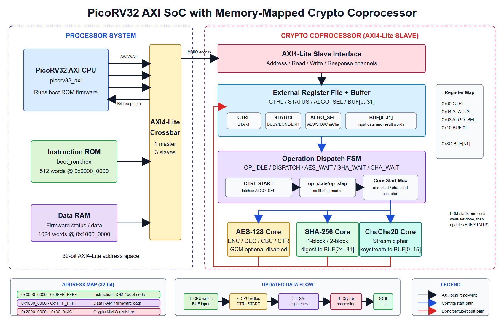

# CryptoCore RV32

**A PicoRV32-based RISC-V SoC with a memory-mapped cryptographic coprocessor for the PYNQ-Z2 FPGA.**

[](https://en.wikipedia.org/wiki/Verilog)
[](https://www.amd.com/en/products/software/adaptive-socs-and-fpgas/vivado.html)
[](https://www.tulembedded.com/FPGA/ProductsPYNQ-Z2.html)
[](https://github.com/YosysHQ/picorv32)

CryptoCore RV32 integrates a small RV32I processor, an AXI4-Lite interconnect, instruction ROM, data RAM, and dedicated AES-128, SHA-256, and ChaCha20 hardware cores. Firmware controls every accelerator through a shared memory-mapped register interface; no custom RISC-V instruction is required.

> Academic FPGA prototype. The design has not been hardened or certified for production cryptographic use and does not implement side-channel countermeasures.



## Highlights

- PicoRV32 configured as the single AXI4-Lite master.
- Three AXI4-Lite slaves: boot ROM, data RAM, and cryptographic coprocessor.
- AES-128 encryption/decryption with ECB-style single-block operation, two-block CBC, and two-block CTR modes.
- SHA-256 one-block and two-block processing.
- ChaCha20 512-bit keystream-block generation.
- Unified `CTRL`, `STATUS`, `ALGO_SEL`, and `BUF[0..31]` register interface.
- End-to-end firmware Known-Answer Tests (KATs), module-level testbenches, and board-visible status.
- PYNQ-Z2 implementation at a 50 MHz SoC clock.

## Measured Results

The following values were recorded for the thesis implementation and its associated benchmark setup. CPU-only results use AES-, SHA-, and ChaCha-like software kernels; the hardware-assisted results run the actual cryptographic cores. The reported speedup is a comparison of these benchmark workloads, not of algorithm-equivalent software and hardware implementations.

| Metric | CPU only | CPU + coprocessor | Change |
|---|---:|---:|---:|
| Total benchmark cycles | 5,211 | 1,853 | 2.81x faster |
| Total time at 50 MHz | 104.22 us | 37.06 us | 64.4% lower |
| Slice LUTs | 958 | 9,132 | 9.53x |
| Slice registers | 662 | 8,092 | 12.22x |
| BRAM tiles | 2.5 | 11.5 | 4.60x |
| Estimated on-chip power | 0.227 W | 0.268 W | +18.1% |
| Setup WNS | +10.194 ns | +2.840 ns | Timing met |

Processing-window throughput, normalized to a 64-byte payload at 50 MHz, was approximately 278.26 Mb/s for AES-128, 192.48 Mb/s for SHA-256, and 304.76 Mb/s for ChaCha20. This interval excludes input loading and result readback. See [Results](docs/results.md) for measurement boundaries and calculations.

## Repository Layout

```text
.
|-- CryptoCore_RV32.srcs/
|   |-- sources_1/
|   |   |-- imports/rtl/       # SoC, AXI4-Lite, and crypto RTL
|   |   |-- imports/firmware/  # Boot firmware sources and ROM images
|   |   `-- new/picorv32.v     # Third-party PicoRV32 core
|   |-- sim_1/imports/tb/      # Module, interface, firmware, and trap tests
|   `-- constrs_1/             # PYNQ-Z2 pin and clock constraints
|-- manual_sim_runs/           # Vivado waveform setup scripts
|-- scripts/                   # Recreate, simulate, and build scripts
|-- docs/                      # Architecture, verification, results, and figures
`-- README.md
```

Vivado project files contain workstation-specific metadata and are intentionally not versioned. Use `scripts/create_project.tcl` to create a fresh project under the ignored `build/` directory. An existing local `.xpr` can still remain in the working folder without being committed.

## Requirements

- AMD Vivado 2025.1 or a compatible recent version.
- PYNQ-Z2 board files (`tul.com.tw:pynq-z2:part0:1.0`) for board-aware project setup.
- PYNQ-Z2 / XC7Z020-1CLG400 FPGA for hardware deployment.
- Prebuilt ROM images are included, so no RISC-V compiler is required to run the demonstration. The repository does not currently provide a complete firmware rebuild toolchain; see [Firmware notes](docs/firmware.md).

## Quick Start

### 1. Recreate the Vivado project

From the repository root:

```powershell
vivado -mode batch -source scripts/create_project.tcl
```

The generated project is `build/CryptoCore_RV32.xpr`.

### 2. Run a simulation

```powershell
vivado -mode batch -source scripts/run_sim.tcl -tclargs tb_soc_firmware
```

Other useful tops include `tb_crypto_axi`, `tb_aes_modes_axi`, `tb_sha256_core`, `tb_chacha20_core`, `tb_crypto_perf`, and `tb_soc_trap_firmware`.

### 3. Build the bitstream and reports

```powershell
vivado -mode batch -source scripts/build_bitstream.tcl -tclargs 4
```

The optional argument is the number of parallel jobs. Final files are copied to `artifacts/`, which is intentionally ignored by Git.

## Memory Map

| Address range | Module | Purpose |
|---|---|---|
| `0x0000_0000` - `0x0000_07FF` | Instruction ROM | 512 firmware words |
| `0x1000_0000` - `0x1000_0FFF` | Data RAM | 1,024 runtime words |
| `0x2000_0000` - `0x2000_008C` | Crypto MMIO | Control, status, selector, and shared buffer |

See [Architecture](docs/architecture.md) for the register map, algorithm selectors, data flow, and board I/O behavior.

## Documentation

- [Architecture and programming model](docs/architecture.md)
- [Verification guide and waveform index](docs/verification.md)
- [Implementation and performance results](docs/results.md)
- [Firmware notes](docs/firmware.md)
- [Repository file guide](docs/repository-guide.md)
- [Annotated boot ROM listing](docs/firmware_listing.md)

## Authors

- Cao Thành An
- Phan Khánh Trình

Faculty of Advanced Education, Ho Chi Minh City University of Technology and Engineering (HCMUTE), 2026.

## Third-Party Code and Licensing

`picorv32.v` is derived from the YosysHQ PicoRV32 project and retains its original ISC-style license notice. See [Third-Party Notices](THIRD_PARTY_NOTICES.md).

No repository-wide license has been selected yet. Until a `LICENSE` file is added, the authors retain all rights to the original RTL, firmware, documentation, and media in this repository.
