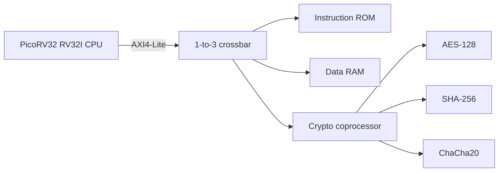
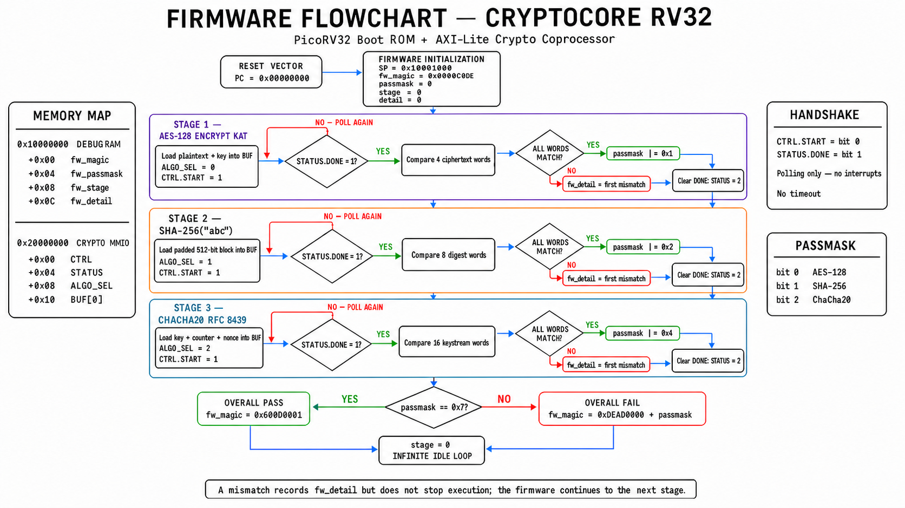

# Architecture

## System Overview

CryptoCore RV32 is a single-master, three-slave SoC. A PicoRV32 core issues instruction, data, and MMIO transactions through one AXI4-Lite master port. The crossbar selects a slave from the high address nibble and returns the selected response to the CPU.

## Address Decoding

The crossbar decodes the upper address region:

| Address range | Decode | Target | Implemented capacity |
|---|---|---|---:|
| `0x0000_0000` - `0x0000_07FF` | `0x0xxx_xxxx` | Boot ROM | 512 x 32-bit words |
| `0x1000_0000` - `0x1000_0FFF` | `0x1xxx_xxxx` | Data RAM | 1,024 x 32-bit words |
| `0x2000_0000` - `0x2000_008C` | `0x2xxx_xxxx` | Crypto MMIO | Control registers and 32-word buffer |

The broad `0x0xxx_xxxx`, `0x1xxx_xxxx`, and `0x2xxx_xxxx` regions are crossbar selections. The narrower ranges above are the actual storage or register locations used by this implementation.

## Crypto Register Map

Base address: `0x2000_0000`.

| Offset | Register | Access | Function |
|---:|---|---|---|
| `0x00` | `CTRL` | R/W | Write bit 0 as `1` to request `START`; hardware self-clears the command |
| `0x04` | `STATUS` | R/W1C-like | Bit 0 `BUSY`, bit 1 `DONE`, bit 2 `ERROR`; writing bit 1/2 clears the corresponding sticky flag |
| `0x08` | `ALGO_SEL` | R/W | Selects the operation latched when `START` is accepted |
| `0x10` - `0x8C` | `BUF[0..31]` | R/W | Shared 32-bit input, key, IV/counter, and result words |

Writes honor AXI `WSTRB`: each asserted strobe updates one byte of the addressed 32-bit register, while an unasserted byte retains its previous value.

## Algorithm Selectors

| `ALGO_SEL` | Operation | Notes |
|---:|---|---|
| `0` | AES-128 encrypt | One 128-bit block |
| `1` | SHA-256 | One padded 512-bit block |
| `2` | ChaCha20 | One 512-bit keystream block |
| `3` | AES-128 decrypt | One 128-bit block |
| `4` | AES-128 CBC encrypt | Two 128-bit blocks |
| `5` | AES-128 CBC decrypt | Two 128-bit blocks |
| `6` | AES-128 CTR | Two 128-bit blocks; encryption and decryption use the same XOR datapath |
| `7` | AES-128 GCM | Optional and disabled by default |
| `8` | SHA-256 | Two chained 512-bit blocks |

## Operation Flow

1. Firmware writes operands, keys, and mode-specific values into `BUF[0..31]`.
2. Firmware writes `ALGO_SEL`.
3. Firmware writes `CTRL.START = 1`.
4. The operation-dispatch FSM latches the selector, asserts the selected core's start signal, and sets `STATUS.BUSY`.
5. The selected iterative core processes the request while the CPU polls `STATUS`.
6. The FSM stores result words back into `BUF`, clears `BUSY`, and sets `DONE`. Unsupported or invalid requests set `ERROR`.
7. Firmware reads the result and clears the sticky completion status before starting another operation.

## AXI4-Lite Handshake

Each AXI4-Lite channel transfers data only when `VALID` and `READY` are both high on the same rising clock edge. Read and write paths are independent:

- Write transaction: address handshake (`AW`) + data handshake (`W`) + response handshake (`B`).
- Read transaction: address handshake (`AR`) + data handshake (`R`).

The implementation supports independent arrival of write address and write data, then commits the register or memory update when both have been captured.

## Board-Level I/O

`BTN[0]` requests reset. `SW[0]` selects the four user LEDs:

| `SW[0]` | LED mode | `LED[3:0]` |
|---:|---|---|
| `0` | System status | AXI activity, CPU trap, reset active, heartbeat |
| `1` | Firmware result | `fw_passmask[3:0]`; bits 0/1/2 represent AES/SHA/ChaCha KAT pass status |

The Pmod JB header exposes the 50 MHz clock, reset, trap, AXI read/write activity, heartbeat, and selected firmware status bits for an external logic analyzer.
