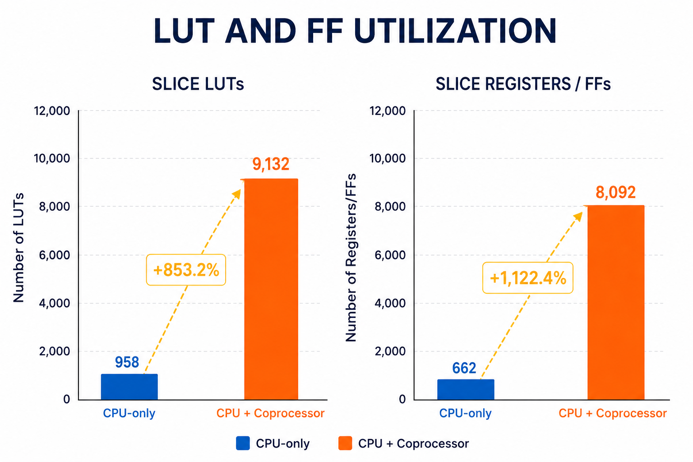
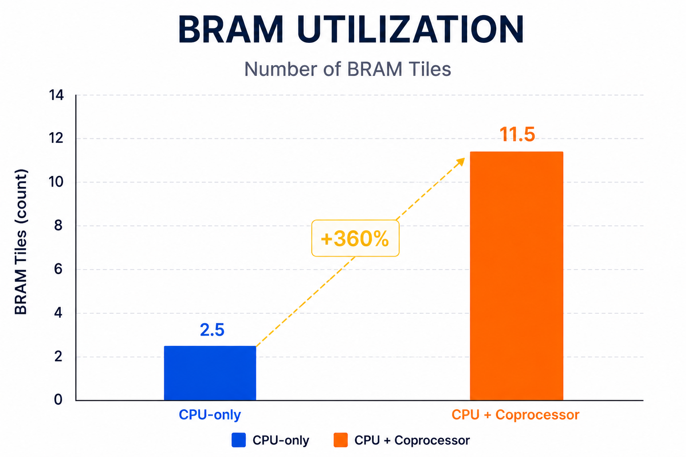
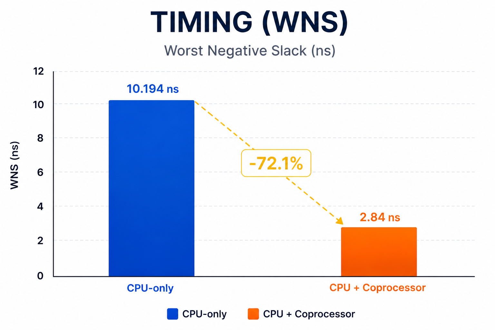
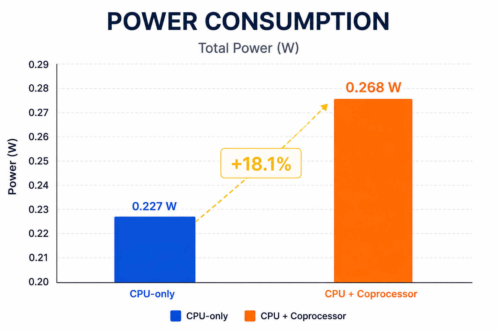

# Results

## Implementation Cost

Target device: XC7Z020-1CLG400 on PYNQ-Z2. The SoC clock is 50 MHz.

| Metric | CPU only | CPU + crypto coprocessor | Relative change |
|---|---:|---:|---:|
| Slice LUTs | 958 | 9,132 | 9.53x |
| Slice registers / FFs | 662 | 8,092 | 12.22x |
| BRAM tiles | 2.5 | 11.5 | 4.60x |
| Estimated on-chip power | 0.227 W | 0.268 W | +18.1% |
| Setup WNS | +10.194 ns | +2.840 ns | Timing met in both designs |

The coprocessor increases logic and memory use because all three cryptographic datapaths coexist in hardware. The timing margin is reduced but remains positive at the 50 MHz target. Estimated power rises moderately relative to the increase in hardware resources.

## Benchmark-Level Performance

| Workload | CPU-only cycles | CPU + coprocessor cycles | Measured speedup |
|---|---:|---:|---:|
| AES / AES-like | 1,196 | 367 | 3.26x |
| SHA / SHA-like | 2,608 | 529 | 4.93x |
| ChaCha / ChaCha-like | 1,244 | 794 | 1.57x |
| Sum of the three measured stages | 5,048 | 1,690 | 2.99x |
| Outside the three stage intervals | 163 | 163 | - |
| Combined benchmark | 5,211 | 1,853 | 2.81x |

At 50 MHz, the combined measured interval falls from 104.22 us to 37.06 us. These are benchmark-level measurements and include software/control overhead. They should not be interpreted as pure core latency.

The stage counts and the combined count use different boundaries. In `tb_soc_firmware`, each stage runs from the observed stage marker to its pass-mask update, while the total runs from reset release to the overall pass marker. Initialization, inter-stage control, and final reporting can therefore fall outside the stage intervals. Subtracting the recorded stage sums leaves 163 cycles in each design; this is aggregate overhead, not an additional cryptographic stage. The current repository includes the hardware-assisted testbench but not a complete CPU-only simulation setup, so the CPU-only figures remain historical measurements rather than results that can be reproduced from this checkout alone.

Time is calculated as `cycles / 50 MHz`: each cycle is 0.02 us. Overall speedup is `5211 / 1853 = 2.8122`, and the reduction in total execution time is `(1 - 1853 / 5211) * 100 = 64.44%`.

The CPU-only benchmark uses compact software kernels intended to exercise comparable operation classes, while the hardware-assisted benchmark invokes the implemented accelerator cores. Therefore, the speedup demonstrates system-level acceleration in this project rather than a strict cycle-for-cycle comparison between identical algorithm implementations.

## Processing-Window Throughput

For a normalized 64-byte payload at 50 MHz:

| Accelerator workload | Recorded cycles | Payload | Throughput at 50 MHz |
|---|---:|---:|---:|
| AES-128: four separate 128-bit encryptions | 92 total | 64 bytes | 278.26 Mb/s |
| SHA-256: two chained blocks including message padding | 133 | 64 message bytes | 192.48 Mb/s |
| ChaCha20: one keystream block | 84 | 64 output bytes | 304.76 Mb/s |

These values use `throughput (Mb/s) = payload_bits * clock_MHz / measured_cycles`. For example, AES-128 gives `512 * 50 / 92 = 278.26 Mb/s`. The 100 MHz simulation clock used by `tb_crypto_perf` supplies cycle counts; the table converts those counts to the 50 MHz board clock.

`tb_crypto_perf.start_and_measure` writes `ALGO_SEL` and `CTRL`, then records the cycle counter when it observes `op_busy == 1`. It stops counting when it observes `op_done == 1`. Since the counter is sampled after the `CTRL` write task returns, the interval can omit some cycles at the beginning of the operation. It is neither a precise core-start-to-core-done latency nor an end-to-end MMIO throughput measurement. Input writes, result reads, and the gaps between the four AES requests are excluded. SHA-256 counts the second block required by padding but uses the 64-byte message as its payload; ChaCha20 measures keystream generation without plaintext XOR.

Throughput comparisons with external works require caution because FPGA family, clock frequency, architecture, payload size, interface overhead, and measurement boundaries differ. This design prioritizes programmable SoC integration and a common AXI4-Lite interface over maximum standalone-core throughput.

## Summary

The measured result is an area-performance trade-off: dedicated cryptographic RTL reduces workload latency by 2.81x in the project benchmark while consuming more FPGA logic and BRAM. The implemented design still meets the 50 MHz timing target and remains within the PYNQ-Z2 device capacity.
