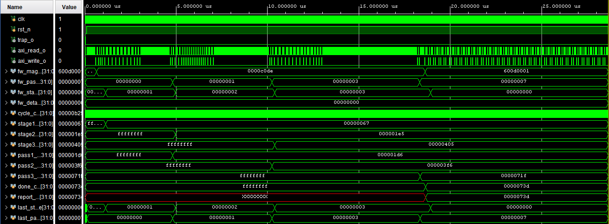
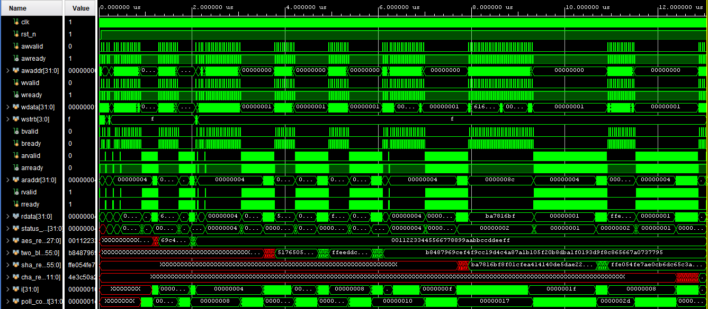
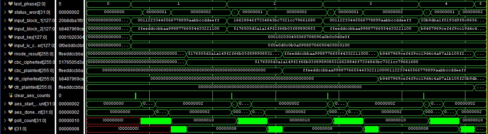
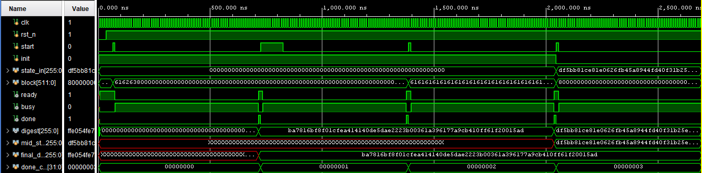

# Verification

## Testbench Matrix

| Testbench | Scope | Main checks |
|---|---|---|
| `tb_aes128_core` | AES core | AES-128 encrypt/decrypt known-answer behavior |
| `tb_sha256_core` | SHA core | One-block and chained-block digest behavior |
| `tb_chacha20_core` | ChaCha core | RFC 8439-style keystream block |
| `tb_aes_modes_axi` | Crypto MMIO + AES | CBC encrypt/decrypt and CTR round trip through AXI4-Lite |
| `tb_crypto_axi` | Crypto MMIO | Register access, all selectors, status, invalid selector, and result data |
| `tb_axi_lite_crossbar` | Interconnect | Address routing and response return paths |
| `tb_axi_lite_mem` | ROM/RAM | Read-only ROM, RAM read/write, and byte strobes |
| `tb_soc_firmware` | Complete SoC | Boot firmware, three algorithm KATs, pass mask, and firmware status |
| `tb_soc_trap_firmware` | Complete SoC | Deliberate illegal instruction and CPU trap reporting |
| `tb_pynq_z2_top_status` | Board top | LED selection and Pmod JB status mapping with forced clock/reset/status inputs |
| `tb_crypto_perf` | Crypto MMIO | Operation cycle measurements used by the performance study |

## Running Tests

Recreate the project once:

```powershell
vivado -mode batch -source scripts/create_project.tcl
```

Run any supported testbench:

```powershell
vivado -mode batch -source scripts/run_sim.tcl -tclargs tb_crypto_axi
vivado -mode batch -source scripts/run_sim.tcl -tclargs tb_soc_firmware
vivado -mode batch -source scripts/run_sim.tcl -tclargs tb_aes_modes_axi
```

The testbenches are self-checking and print pass/fail diagnostics to the Vivado transcript. Waveform setup scripts for interactive inspection are stored in `manual_sim_runs/`.

## Representative Waveforms

### End-to-End Firmware



### AXI4-Lite Crypto Interface



### AES CBC and CTR Modes



### SHA-256



## Verification Limits

- Simulation and board tests establish functional behavior for the included vectors; they are not a formal proof of cryptographic correctness.
- No side-channel leakage, fault-injection resistance, or constant-time software claim is made.
- Power values are Vivado estimates, not direct current measurements.
- Timing closure applies to the documented PYNQ-Z2 implementation and constraints.
- `tb_pynq_z2_top_status` forces internal clock, reset, and status signals to check output mapping. It does not verify MMCM lock behavior, reset sequencing, or the physical 50 MHz clock.
